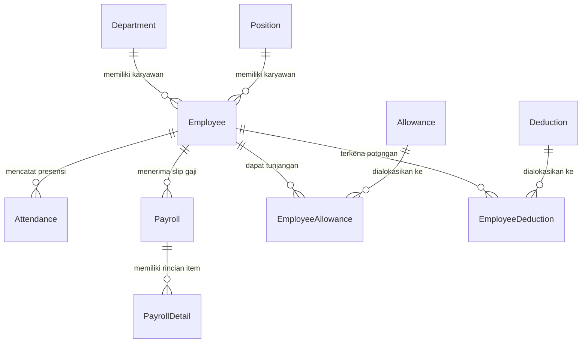

# Dokumen Petunjuk & Dokumentasi Struktur Database (Prisma Schema)
## Sistem Penggajian (Payroll Management System)

Dokumen ini berisi panduan lengkap dan rinci mengenai rancangan basis data (*database schema*) pada **Sistem Penggajian** ini. Database menggunakan **PostgreSQL** dengan ORM **Prisma**.

> Sumber kebenaran skema adalah file [`prisma/schema.prisma`](../prisma/schema.prisma) — bila dokumen ini dan file tersebut berbeda, ikuti file schema. Dokumen terkait: [PAYROLL_SYSTEM_GUIDE.md](PAYROLL_SYSTEM_GUIDE.md) (alur bisnis & rumus) dan [STRUCTURE_GUIDE.md](STRUCTURE_GUIDE.md) (peta struktur folder & file kode).

---

## 📌 Ringkasan Konvensi Umum Database
1. **Primary Key**: Semua tabel menggunakan kolom `id` bertipe `String` yang di-generate secara otomatis menggunakan format `UUID`.
2. **Audit Timestamps**: Setiap tabel dilengkapi dengan `createdAt` (`DateTime` default saat dibuat) dan `updatedAt` (`DateTime` otomatis terisi saat update).
3. **Penamaan Tabel (SQL Mapping)**: Penamaan model Prisma dalam format *PascalCase*, dipetakan ke nama tabel SQL berformat *snake_case* jamak melalui atribut `@@map(...)` (contoh: model `Employee` dipetakan ke tabel `employees`).
4. **Tipe Data Keuangan**: Semua atribut nominal uang (seperti `baseSalary`, `amount`, `netSalary`, `value`) menggunakan tipe `Decimal` dengan presisi `Decimal(15, 2)` untuk menghindari *floating-point rounding errors*.

---

## 🏷️ Tipe Enumerasi (Enums)

### 1. `EmploymentStatus`
Menyatakan status kepegawaian dari seorang karyawan:
- `ACTIVE`: Karyawan masih aktif bekerja.
- `INACTIVE`: Karyawan non-aktif sementara.
- `RESIGNED`: Karyawan telah mengundurkan diri secara resmi.
- `TERMINATED`: Karyawan telah diberhentikan/PHK.

### 2. `AttendanceStatus`
Menyatakan status kehadiran karyawan pada tanggal tertentu:
- `PRESENT`: Hadir bekerja tepat waktu.
- `LATE`: Hadir tetapi terlambat.
- `LEAVE`: Cuti resmi.
- `SICK`: Izin sakit.
- `VACATION`: Libur / Cuti tahunan.
- `ABSENT`: Mangkir / Alpa tanpa keterangan.

### 3. `PayrollStatus`
Menyatakan siklus hidup (*lifecycle*) pemrosesan slip gaji bulanan:
- `DRAFT`: Draf awal perhitungan gaji, masih bisa diubah/direvisi.
- `APPROVED`: Gaji telah disetujui oleh manajer/manajemen.
- `PAID`: Gaji telah ditransfer/dibayarkan ke karyawan.

### 4. `PayrollDetailType`
Kategori item rincian gaji dalam komponen payroll:
- `EARNING`: Komponen penambah penghasilan (tunjangan, lembur, bonus).
- `DEDUCTION`: Komponen pengurang penghasilan (potongan BPJS, pajak, denda keterlambatan/absensi).

### 5. `DeductionType`
Kategori metode perhitungan potongan bulanan:
- `FIXED`: Potongan dengan nilai nominal tetap (dalam Rupiah).
- `PERCENTAGE`: Potongan berbasis persentase (%) dari gaji pokok karyawan.

### 6. `AllowanceType`
Kategori metode perhitungan tunjangan bulanan:
- `FIXED`: Tunjangan dengan nilai nominal tetap (dalam Rupiah).
- `PERCENTAGE`: Tunjangan berbasis persentase (%) dari gaji pokok karyawan.

### 7. `PenaltyType`
Kategori jenis pelanggaran presensi untuk denda/penalti:
- `LATE`: Penalti akibat keterlambatan jam masuk kerja.
- `ABSENT`: Penalti akibat ketidakhadiran tanpa izin / alpa.

### 8. `PenaltyMode`
Kategori metode kalkulasi denda penalti:
- `FIXED`: Denda bernilai nominal tetap (dalam Rupiah).
- `PERCENTAGE`: Denda berbasis persentase (%) dari gaji pokok karyawan.

### 9. `UserRole`
Menyatakan peran (role) login pengguna pada kolom `Employee.role`:
- `ADMIN`: Akses penuh ke seluruh halaman & API admin.
- `EMPLOYEE`: Hanya dapat mengakses portal karyawan (kehadiran, slip gaji, dan profil miliknya sendiri).

> Catatan: akun admin utama TIDAK disimpan di tabel `employees` — kredensialnya berasal dari environment variable `ADMIN_ID`/`ADMIN_PASSWORD`. Kolom `role` dipakai bila sebuah akun karyawan diberi peran admin.

---

## 🗄️ Detail Model & Tabel Database

---

### 1. Model `Department` ➔ Tabel `departments`
Mengelola master data departemen atau divisi dalam perusahaan (misal: *Engineering, HR, Finance*).

| Nama Kolom | Tipe Data | Constraints / Default | Deskripsi & Fungsi |
| :--- | :--- | :--- | :--- |
| `id` | `String` | `@id`, `@default(uuid())` | Primary key unik untuk departemen. |
| `name` | `String` | `@unique` | Nama departemen (unik, tidak boleh sama). |
| `description` | `String?` | Optional | Penjelasan singkat fungsi departemen. |
| `createdAt` | `DateTime` | `@default(now())` | Waktu data dibuat. |
| `updatedAt` | `DateTime` | `@updatedAt` | Waktu data terakhir diperbarui. |

**Relasi**:
- `employees`: 1 Department memiliki banyak (`1-to-N`) `Employee`.

---

### 2. Model `Position` ➔ Tabel `positions`
Mengelola master data jabatan atau posisi pekerjaan (misal: *Software Engineer, HR Manager*) serta tunjangan standar jabatan tersebut.

| Nama Kolom | Tipe Data | Constraints / Default | Deskripsi & Fungsi |
| :--- | :--- | :--- | :--- |
| `id` | `String` | `@id`, `@default(uuid())` | Primary key unik untuk jabatan. |
| `name` | `String` | `@unique` | Nama jabatan (unik). |
| `baseAllowance` | `Decimal` | `@default(0)`, `Decimal(15,2)` | Tunjangan standar/dasar untuk jabatan ini. |
| `description` | `String?` | Optional | Deskripsi tugas/tanggung jawab posisi. |
| `createdAt` | `DateTime` | `@default(now())` | Waktu data dibuat. |
| `updatedAt` | `DateTime` | `@updatedAt` | Waktu data terakhir diperbarui. |

**Relasi**:
- `employees`: 1 Position dimiliki oleh banyak (`1-to-N`) `Employee`.

---

### 3. Model `Employee` ➔ Tabel `employees`
Tabel utama master data karyawan/pegawai perusahaan.

| Nama Kolom | Tipe Data | Constraints / Default | Deskripsi & Fungsi |
| :--- | :--- | :--- | :--- |
| `id` | `String` | `@id`, `@default(uuid())` | Primary key unik untuk karyawan. |
| `code` | `String` | `@unique` | Nomor Induk Karyawan (NIK / Kode Karyawan). |
| `fullName` | `String` | - | Nama lengkap karyawan. |
| `email` | `String` | `@unique` | Alamat email unik karyawan. |
| `phone` | `String?` | Optional | Nomor telepon/WhatsApp. |
| `address` | `String?` | Optional | Alamat tempat tinggal. |
| `hireDate` | `DateTime` | - | Tanggal resmi karyawan mulai bekerja. |
| `status` | `EmploymentStatus` | `@default(ACTIVE)` | Status kepegawaian (ACTIVE, INACTIVE, RESIGNED, TERMINATED). |
| `baseSalary` | `Decimal` | `Decimal(15,2)` | Gaji pokok per bulan. |
| `password` | `String` | - | **Hash bcrypt** password login portal karyawan (tidak pernah plaintext; di-omit global dari seluruh response API). |
| `role` | `UserRole` | `@default(EMPLOYEE)` | Role login (`ADMIN` / `EMPLOYEE`) — dibaca ke payload sesi saat login. |
| `departmentId` | `String` | Foreign Key, `@index` | ID referensi ke departemen tempat bekerja. |
| `positionId` | `String` | Foreign Key, `@index` | ID referensi ke jabatan karyawan. |
| `createdAt` | `DateTime` | `@default(now())` | Waktu data dibuat. |
| `updatedAt` | `DateTime` | `@updatedAt` | Waktu data terakhir diperbarui. |

**Relasi**:
- `department`: Belongs to `Department`.
- `position`: Belongs to `Position`.
- `attendances`: Has many `Attendance`.
- `payrolls`: Has many `Payroll`.
- `employeeAllowances`: Has many `EmployeeAllowance`.
- `employeeDeductions`: Has many `EmployeeDeduction`.

---

### 4. Model `Attendance` ➔ Tabel `attendances`
Mencatat presensi harian karyawan, termasuk jam masuk/keluar dan kalkulasi keterlambatan serta lembur.

| Nama Kolom | Tipe Data | Constraints / Default | Deskripsi & Fungsi |
| :--- | :--- | :--- | :--- |
| `id` | `String` | `@id`, `@default(uuid())` | Primary key unik presensi. |
| `employeeId` | `String` | Foreign Key, `@index` | ID karyawan pemilik presensi. |
| `date` | `DateTime` | `@db.Date` | Tanggal presensi (hanya bagian tanggal, UTC midnight). |
| `status` | `AttendanceStatus` | `@default(PRESENT)` | Status kehadiran (PRESENT, LATE, SICK, dll). |
| `checkIn` | `DateTime?` | Optional | Jam masuk sebagai **wall-clock UTC-anchored** (`...T08:00:00Z` = jam 08:00). Klien wajib merender dengan getter UTC. |
| `checkOut` | `DateTime?` | Optional | Jam pulang, konvensi sama dengan `checkIn`. |
| `lateMinutes` | `Int` | `@default(0)` | Jumlah durasi keterlambatan dalam menit. |
| `overtimeHours` | `Decimal` | `@default(0)`, `Decimal(5,2)` | Durasi jam kerja lembur pada hari tersebut. |
| `workingHours` | `Decimal` | `@default(0)`, `Decimal(5,2)` | Total jam kerja efektif pada hari tersebut. |
| `notes` | `String?` | Optional | Catatan tambahan (misal: alasan izin/sakit). |
| `createdAt` | `DateTime` | `@default(now())` | Waktu pencatatan. |
| `updatedAt` | `DateTime` | `@updatedAt` | Waktu pembaruan pencatatan. |

**Constraints Khusus**:
- `@@unique([employeeId, date])`: Seorang karyawan hanya boleh memiliki 1 record presensi per tanggal.
- `@@index([date])`: Mempercepat query rentang tanggal lintas karyawan (laporan bulanan).
- Perubahan data kehadiran **ditolak (409)** bila payroll karyawan untuk periode tanggal tersebut sudah berstatus `APPROVED`/`PAID`.

---

### 5. Model `Allowance` ➔ Tabel `allowances`
Master data jenis-jenis tunjangan yang tersedia dalam sistem (misal: Tunjangan Makan, Tunjangan Transportasi, Performance Bonus).

| Nama Kolom | Tipe Data | Constraints / Default | Deskripsi & Fungsi |
| :--- | :--- | :--- | :--- |
| `id` | `String` | `@id`, `@default(uuid())` | Primary key unik jenis tunjangan. |
| `name` | `String` | `@unique` | Nama tunjangan (misal: "Tunjangan Transport"). |
| `type` | `AllowanceType` | `@default(FIXED)` | Tipe metode tunjangan (`FIXED` nominal tetap atau `PERCENTAGE` persentase gaji). |
| `amount` | `Decimal` | `Decimal(15,2)` | Nominal rupiah (jika FIXED) atau persentase % (jika PERCENTAGE). |
| `description` | `String?` | Optional | Penjelasan syarat/aturan tunjangan. |
| `isActive` | `Boolean` | `@default(true)` | Status aktif/tidaknya jenis tunjangan ini. |
| `createdAt` | `DateTime` | `@default(now())` | Waktu dibuat. |
| `updatedAt` | `DateTime` | `@updatedAt` | Waktu diperbarui. |

---

### 6. Model `Deduction` ➔ Tabel `deductions`
Master data jenis-jenis potongan gaji bulanan (misal: BPJS Kesehatan, BPJS Ketenagakerjaan, Potongan Koperasi).

| Nama Kolom | Tipe Data | Constraints / Default | Deskripsi & Fungsi |
| :--- | :--- | :--- | :--- |
| `id` | `String` | `@id`, `@default(uuid())` | Primary key unik jenis potongan. |
| `name` | `String` | `@unique` | Nama potongan (misal: "BPJS Kesehatan"). |
| `type` | `DeductionType` | `@default(FIXED)` | Tipe metode potongan (`FIXED` nominal tetap atau `PERCENTAGE` persentase gaji). |
| `amount` | `Decimal` | `Decimal(15,2)` | Nominal rupiah (jika FIXED) atau persentase % (jika PERCENTAGE). |
| `description` | `String?` | Optional | Penjelasan aturan/kalkulasi potongan. |
| `isActive` | `Boolean` | `@default(true)` | Status aktif/tidaknya jenis potongan ini. |
| `createdAt` | `DateTime` | `@default(now())` | Waktu dibuat. |
| `updatedAt` | `DateTime` | `@updatedAt` | Waktu diperbarui. |

---

### 7. Model `EmployeeAllowance` ➔ Tabel `employee_allowances`
Tabel penghubung (*junction table / Many-to-Many*) untuk memetakan tunjangan mana saja yang berhak diterima oleh karyawan tertentu. **Tabel ini adalah sumber otoritatif perhitungan payroll** — engine hanya membayarkan tunjangan yang ter-assign di sini (dan masternya masih aktif).

| Nama Kolom | Tipe Data | Constraints / Default | Deskripsi & Fungsi |
| :--- | :--- | :--- | :--- |
| `id` | `String` | `@id`, `@default(uuid())` | Primary key unik relasi. |
| `employeeId` | `String` | Foreign Key (Cascade Delete) | ID karyawan yang menerima tunjangan. |
| `allowanceId` | `String` | Foreign Key (Cascade Delete) | ID tunjangan yang dialokasikan. |
| `createdAt` | `DateTime` | `@default(now())` | Waktu pengalokasian dibuat. |
| `updatedAt` | `DateTime` | `@updatedAt` | Waktu pengalokasian diperbarui. |

**Constraints Khusus**:
- `@@unique([employeeId, allowanceId])`: Kombinasi karyawan dan jenis tunjangan bersifat unik.

---

### 8. Model `EmployeeDeduction` ➔ Tabel `employee_deductions`
Tabel penghubung (*junction table / Many-to-Many*) untuk memetakan potongan mana saja yang dikenakan pada karyawan tertentu. **Tabel ini adalah sumber otoritatif perhitungan payroll** — engine hanya memotong potongan yang ter-assign di sini (dan masternya masih aktif).

| Nama Kolom | Tipe Data | Constraints / Default | Deskripsi & Fungsi |
| :--- | :--- | :--- | :--- |
| `id` | `String` | `@id`, `@default(uuid())` | Primary key unik relasi. |
| `employeeId` | `String` | Foreign Key (Cascade Delete) | ID karyawan yang dikenakan potongan. |
| `deductionId` | `String` | Foreign Key (Cascade Delete) | ID potongan yang dialokasikan. |
| `createdAt` | `DateTime` | `@default(now())` | Waktu pengalokasian dibuat. |
| `updatedAt` | `DateTime` | `@updatedAt` | Waktu pengalokasian diperbarui. |

**Constraints Khusus**:
- `@@unique([employeeId, deductionId])`: Kombinasi karyawan dan jenis potongan bersifat unik.

---

### 9. Model `Payroll` ➔ Tabel `payrolls`
Header kalkulasi penggajian bulanan untuk tiap karyawan pada periode tertentu.

| Nama Kolom | Tipe Data | Constraints / Default | Deskripsi & Fungsi |
| :--- | :--- | :--- | :--- |
| `id` | `String` | `@id`, `@default(uuid())` | Primary key unik slip penggajian. |
| `employeeId` | `String` | Foreign Key, `@index` | ID karyawan penerima gaji. |
| `month` | `Int` | `@index([month, year])` | Bulan periode gaji (1 - 12). |
| `year` | `Int` | `@index([month, year])` | Tahun periode gaji (misal: 2026). |
| `basicSalary` | `Decimal` | `Decimal(15,2)` | Gaji pokok yang dihitung untuk periode ini. |
| `allowanceTotal`| `Decimal` | `@default(0)`, `Decimal(15,2)` | Akumulasi total seluruh tunjangan. |
| `deductionTotal`| `Decimal` | `@default(0)`, `Decimal(15,2)` | Akumulasi total seluruh potongan. |
| `overtimePay` | `Decimal` | `@default(0)`, `Decimal(15,2)` | Total uang lembur yang didapat pada periode ini. |
| `bonus` | `Decimal` | `@default(0)`, `Decimal(15,2)` | Bonus insentif/tambahan jika ada. |
| `netSalary` | `Decimal` | `Decimal(15,2)` | Gaji bersih (*take-home pay*): `max(0, (basicSalary + allowanceTotal + overtimePay + bonus) - deductionTotal)` — di-clamp ke 0 dengan baris detail "Penyesuaian Gaji Minimum" bila potongan melebihi penerimaan. |
| `status` | `PayrollStatus` | `@default(DRAFT)` | Status siklus slip gaji. Transisi divalidasi: DRAFT→APPROVED, APPROVED→PAID, APPROVED→DRAFT; PAID final. |
| `approvedAt` | `DateTime?` | Optional | Waktu slip disetujui (di-null-kan bila dikembalikan ke DRAFT). |
| `paidAt` | `DateTime?` | Optional | Waktu slip ditandai dibayar. |
| `createdAt` | `DateTime` | `@default(now())` | Waktu slip dibuat. |
| `updatedAt` | `DateTime` | `@updatedAt` | Waktu slip diperbarui — juga dipakai sebagai pembanding staleness terhadap `Attendance.updatedAt`. |

**Constraints Khusus**:
- `@@unique([employeeId, month, year])`: Hanya boleh ada 1 slip penggajian per karyawan dalam 1 periode bulan dan tahun.

---

### 10. Model `PayrollDetail` ➔ Tabel `payroll_details`
Detail item rincian gaji (breakdown) yang membentuk sebuah record `Payroll`. Menyimpan baris-baris komponen pendapatan/potongan secara individual.

| Nama Kolom | Tipe Data | Constraints / Default | Deskripsi & Fungsi |
| :--- | :--- | :--- | :--- |
| `id` | `String` | `@id`, `@default(uuid())` | Primary key unik detail penggajian. |
| `payrollId` | `String` | Foreign Key (Cascade Delete), `@index` | ID referensi ke header `Payroll`. |
| `component` | `String` | - | Nama komponen (misal: "Tunjangan Transport", "Uang Lembur", "Potongan BPJS", "Penalti Keterlambatan"). |
| `type` | `PayrollDetailType` | - | Kategori komponen (`EARNING` atau `DEDUCTION`). |
| `amount` | `Decimal` | `Decimal(15,2)` | Nominal angka untuk komponen tersebut. |
| `description` | `String?` | Optional | Catatan atau rincian rumus perhitungan komponen. |
| `createdAt` | `DateTime` | `@default(now())` | Waktu baris detail dibuat. |
| `updatedAt` | `DateTime` | `@updatedAt` | Waktu baris detail diperbarui. |

---

### 11. Model `PenaltySetting` ➔ Tabel `penalty_settings`
Mengelola aturan dan pengaturan penalti/denda presensi karyawan untuk keterlambatan bertingkat (tier) dan ketidakhadiran (alpa), terpisah dari master potongan bulanan.

**Semantik fallback**: formula default (legacy) hanya dipakai bila **tidak ada satu pun baris** untuk tipe tersebut di tabel ini. Bila baris ada tetapi semuanya `isActive = false`, penalti tipe tersebut dianggap dimatikan (tanpa denda). Validasi API memastikan rentang tier LATE aktif tidak saling tumpang tindih.

| Nama Kolom | Tipe Data | Constraints / Default | Deskripsi & Fungsi |
| :--- | :--- | :--- | :--- |
| `id` | `String` | `@id`, `@default(uuid())` | Primary key unik aturan penalti. |
| `type` | `PenaltyType` | - | Jenis penalti (`LATE` untuk terlambat, `ABSENT` untuk alpa). |
| `mode` | `PenaltyMode` | - | Mode perhitungan denda (`FIXED` nominal rupiah atau `PERCENTAGE` persentase gaji pokok). |
| `value` | `Decimal` | `Decimal(15,2)` | Nilai denda (Rupiah atau persentase %). |
| `minMinutes` | `Int` | `@default(0)` | Batas minimal menit keterlambatan (khusus tipe `LATE`). |
| `maxMinutes` | `Int?` | Optional | Batas maksimal menit keterlambatan (null = tidak ada batas atas/tak terbatas). |
| `description` | `String?` | Optional | Deskripsi atau nama tier penalti (misal: "Toleransi", "Terlambat Ringan"). |
| `isActive` | `Boolean` | `@default(true)` | Status aktif/tidaknya aturan penalti ini. |
| `createdAt` | `DateTime` | `@default(now())` | Waktu aturan dibuat. |
| `updatedAt` | `DateTime` | `@updatedAt` | Waktu aturan diperbarui. |

---

## 🗺️ Diagram Relasi Antar Tabel (Entity-Relationship)

Berikut adalah peta hubungan relasi antar tabel dalam sistem penggajian ini:

```mermaid
erDiagram
    Department ||--o{ Employee : "memiliki karyawan"
    Position ||--o{ Employee : "memiliki karyawan"
    
    Employee ||--o{ Attendance : "mencatat presensi"
    Employee ||--o{ Payroll : "menerima slip gaji"
    
    Employee ||--o{ EmployeeAllowance : "dapat tunjangan"
    Allowance ||--o{ EmployeeAllowance : "dialokasikan ke"
    
    Employee ||--o{ EmployeeDeduction : "terkena potongan"
    Deduction ||--o{ EmployeeDeduction : "dialokasikan ke"
    
    Payroll ||--o{ PayrollDetail : "memiliki rincian item"
```

> **Catatan tentang `PenaltySetting`:** tabel ini berdiri sendiri (tidak punya foreign key ke tabel mana pun). Hubungannya dengan `Payroll` bersifat *konseptual*: saat generate gaji, engine membaca aturan penalti dari tabel ini untuk menghitung denda keterlambatan/alpa, lalu hasilnya ditulis sebagai baris `PayrollDetail` bertipe `DEDUCTION`.

---

## 💡 Ringkasan Alur Kerja Data (*Data Flow*)

1. **Pengaturan Master Data & Aturan Penalti**:
   - Departemen (`Department`) dan Jabatan (`Position`) disiapkan terlebih dahulu.
   - Jenis-jenis Tunjangan (`Allowance`) dan Potongan (`Deduction`) didaftarkan dengan menentukan apakah nilainya berupa **Nominal Tetap (FIXED)** atau **Persentase Gaji (PERCENTAGE)**.
   - Aturan Denda Presensi (`PenaltySetting`) dikonfigurasi untuk menentukan tier denda keterlambatan (menit min/max) dan denda alpa tanpa izin.
2. **Pengelolaan Karyawan (`Employee`)**:
   - Karyawan didaftarkan dengan menetapkan Gaji Pokok (`baseSalary`), Departemen, dan Jabatan; password awal di-hash bcrypt.
   - Tunjangan dan Potongan dikaitkan per-karyawan melalui `EmployeeAllowance`/`EmployeeDeduction` — default karyawan baru otomatis ter-link ke semua master aktif, dan admin dapat memilih/melepas assignment lewat dialog edit karyawan. Engine payroll HANYA membaca junction ini.
3. **Presensi Harian & Absensi Massal (`Attendance`)**:
   - Setiap hari kerja, sistem mencatat presensi harian atau input absensi massal (`checkIn`, `checkOut`), menghitung `lateMinutes` dan `overtimeHours` secara otomatis.
4. **Pemrosesan Gaji Bulanan (`Payroll` & `PayrollDetail`)**:
   - Di akhir bulan, sistem menjalankan *Generate Batch Payroll* dengan **optimasi bulk pre-fetch query** (tanpa fan-out master — tunjangan/potongan dibaca dari junction per-karyawan).
   - Sistem mencocokkan record kehadiran `PRESENT`/`LATE` dengan `PenaltySetting` untuk menghitung lembur serta denda keterlambatan, dan record `ABSENT` untuk denda alpa.
   - Rincian penerimaan dan potongan di-generate ke dalam `PayrollDetail` (tipe `EARNING` untuk tunjangan/lembur/bonus dan `DEDUCTION` untuk potongan rutin & penalti).
   - Setelah diperiksa, status diubah menjadi `APPROVED` lalu `PAID` (transisi divalidasi; PAID final). Angka uang di dashboard & laporan hanya menghitung payroll `APPROVED`/`PAID` — DRAFT dilaporkan sebagai jumlah terpisah.
