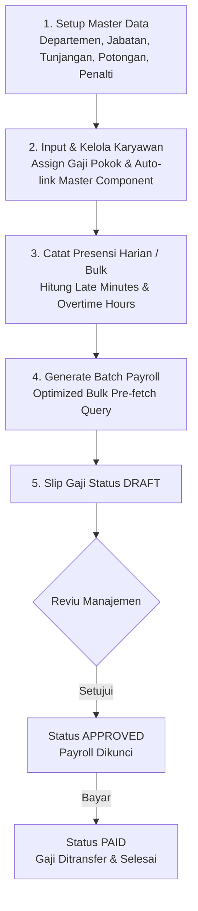

# Panduan Cara Kerja & Arsitektur Sistem Penggajian
## Payroll Management System

Dokumen ini menjelaskan secara rinci alur bisnis, rumus perhitungan matematika, arsitektur teknis, dan cara kerja **Sistem Penggajian** (*Payroll System*).

---

## 📌 1. Pendahuluan & Gambaran Umum

Sistem Penggajian ini dirancang untuk mengotomatiskan seluruh alur penggajian bulanan karyawan perusahaan, mulai dari manajemen master data karyawan, alokasi tunjangan & potongan, pencatatan presensi harian (keterlambatan & lembur), hingga pemrosesan komponen *take-home pay* secara massal (*batch generation*).

Sistem dibangun menggunakan stack teknologi modern:
- **Framework**: Next.js 16 (App Router)
- **Database & ORM**: PostgreSQL dengan Prisma ORM
- **Desain UI**: Tailwind CSS & Shadcn UI

---

## 🧮 2. Rumus Perhitungan & Komponen Gaji

Kalkulasi gaji seorang karyawan dihitung berdasarkan periode bulan dan tahun tertentu dengan akumulasi komponen **Pendapatan (*Earnings*)** dan **Potongan (*Deductions*)**.

### A. Komponen Pendapatan (*Earnings*)

1. **Gaji Pokok (`basicSalary`)**
   Nominal gaji dasar bulanan karyawan yang tercatat pada master data `Employee.baseSalary`.

2. **Tunjangan Jabatan (`positionAllowance`)**
   Tunjangan standar yang melekat pada posisi/jabatan karyawan yang tercatat pada `Position.baseAllowance`.

3. **Tunjangan Bulanan Master & Spesifik (`allowanceTotal`)**
   Tunjangan yang diberikan kepada karyawan melalui alokasi master atau khusus karyawan (`Allowance`).
   - **Mode `FIXED`**: Nominal tetap dalam Rupiah (contoh: Rp 500.000).
   - **Mode `PERCENTAGE`**: Persentase dari Gaji Pokok ($basicSalary \times \frac{\text{persentase}}{100}$).

4. **Uang Lembur (`overtimePay`)**
   Dihitung secara otomatis berdasarkan akumulasi jam lembur karyawan (`Attendance.overtimeHours`) pada bulan tersebut.
   $$\text{Tarif Per Jam} = \frac{\text{basicSalary}}{173}$$
   $$\text{overtimePay} = \text{Math.round}(\text{totalOvertimeHours} \times \text{Tarif Per Jam} \times 1.5)$$

5. **Bonus / Insentif (`bonus`)**
   Bonus tambahan opsional yang dapat diinputkan oleh Admin saat menjalankan proses penggajian.

---

### B. Komponen Potongan (*Deductions*)

1. **Potongan Bulanan Master & Spesifik (`deductionTotal`)**
   Potongan rutin yang dikenakan kepada karyawan (`Deduction`), seperti BPJS Kesehatan, BPJS Ketenagakerjaan, atau Potongan Koperasi.
   - **Mode `FIXED`**: Nominal tetap dalam Rupiah (contoh: Rp 100.000).
   - **Mode `PERCENTAGE`**: Persentase dari Gaji Pokok ($basicSalary \times \frac{\text{persentase}}{100}$).

2. **Denda / Penalti Keterlambatan (`totalLatePenalty`)**
   Dihitung per kejadian terlambat (*per attendance record*) dengan mencocokkan durasi keterlambatan (`lateMinutes`) ke dalam aturan bertingkat pada tabel `PenaltySetting` (`type = LATE`).
   - **Mode `FIXED`**: Denda tetap (misal: 11–30 menit = Rp 10.000 per kejadian).
   - **Mode `PERCENTAGE`**: Persentase dari gaji pokok per kejadian.
   - **Fallback (Default)**: Jika tidak ada aturan aktif di DB, sistem menggunakan formula default: $\text{Math.round}\left(\text{totalLateMinutes} \times \frac{\text{Tarif Per Jam}}{60}\right)$.

3. **Denda / Penalti Ketidakhadiran (`totalAbsentPenalty`)**
   Dihitung per hari alpa/mangkir tanpa keterangan (`status = ABSENT`) mengacu pada `PenaltySetting` (`type = ABSENT`).
   - **Mode `FIXED`**: Nominal denda per hari alpa.
   - **Mode `PERCENTAGE`**: Persentase dari gaji pokok per hari alpa (contoh: 4.55% ≈ 1/22 gaji pokok per hari).
   - **Fallback (Default)**: Jika tidak ada aturan di DB, sistem menggunakan formula default: $\text{Math.round}\left(\text{absentDays} \times \frac{\text{basicSalary}}{22}\right)$.

---

### C. Gaji Bersih (*Net Salary / Take-Home Pay*)

Gaji bersih akhir yang diterima karyawan dihitung dengan rumus:

$$\text{Net Salary} = \max\Big(0,\; \text{basicSalary} + \text{allowanceTotal} + \text{overtimePay} + \text{bonus} - \text{deductionTotal}\Big)$$

---

## 🔄 3. Alur Kerja Pemrosesan Penggajian (*End-to-End Workflow*)

### Penjelasan Tahapan Alur Kerja:

1. **Tahap 1: Setup Master Data & Penalti**
   - Admin mendaftarkan Departemen, Jabatan, Tunjangan (Fixed/Percentage), dan Potongan (Fixed/Percentage).
   - Admin mengonfigurasi aturan penalti Keterlambatan & Ketidakhadiran di halaman Potongan.

2. **Tahap 2: Manajemen Karyawan & Auto-Linking**
   - Saat karyawan baru ditambahkan, sistem secara otomatis menghubungkan karyawan tersebut dengan seluruh Tunjangan Master & Potongan Master yang aktif (`EmployeeAllowance` & `EmployeeDeduction`).

3. **Tahap 3: Pencatatan Presensi & Lembur**
   - Presensi diinput harian atau menggunakan fitur **Bulk Attendance**. Sistem secara otomatis menghitung menit keterlambatan dan jam lembur.

4. **Tahap 4: Pemrosesan Gaji Massal (*Batch Generation*)**
   - Admin memilih bulan & tahun penggajian (serta filter departemen jika diperlukan).
   - Mesin penggajian (`payroll-engine.ts`) mengeksekusi **Bulk Pre-fetch Query** (mengambil seluruh master data dan absensi 1 bulan dalam 1 `Promise.all` paralel) untuk menghindari *N+1 Query Issue*.

5. **Tahap 5: Siklus Slip Gaji (`DRAFT` ➔ `APPROVED` ➔ `PAID`)**
   - Slip gaji yang baru di-generate berstatus **`DRAFT`** (dapat di-generate ulang atau direvisi).
   - Setelah diverifikasi, status diubah menjadi **`APPROVED`** (dikunci, tidak bisa di-generate ulang untuk mencegah perubahan tidak disengaja).
   - Setelah pembayaran berhasil ditransfer, status diubah menjadi **`PAID`**.

---

## 🏗️ 4. Struktur Arsitektur Kode Utama

| Berkas / Direktori | Fungsi & Tanggung Jawab |
| :--- | :--- |
| **`src/lib/payroll-engine.ts`** | Core engine perhitungan gaji. Berisi fungsi `calculateSingleEmployeePayroll`, `generateBatchPayroll`, dan `savePayrollRecord`. |
| **`src/app/api/payroll/route.ts`** | Endpoint API untuk list penggajian dan trigger batch generation. |
| **`src/app/api/payroll/[id]/route.ts`** | Endpoint API untuk detail slip gaji dan pembaruan status (`DRAFT`/`APPROVED`/`PAID`). |
| **`src/app/api/penalty-settings/route.ts`** | Endpoint API CRUD untuk aturan penalti terlambat & alpa. |
| **`src/app/(dashboard)/payroll/page.tsx`** | Antarmuka pengguna untuk memproses batch gaji, melihat daftar slip gaji, dan laporan. |
| **`src/app/(dashboard)/deductions/page.tsx`** | Antarmuka pengguna untuk mengelola potongan bulanan dan pengaturan penalti presensi. |
| **`src/app/(dashboard)/allowances/page.tsx`** | Antarmuka pengguna untuk mengelola tunjangan bulanan. |
| **`docs/DATABASE_GUIDE.md`** | Panduan dokumentasi lengkap mengenai struktur tabel dan ERD database. |

---

## 🛡️ 5. Proteksi Data & Keamanan Transaksi

1. **Prisma Transaction (`prisma.$transaction`)**:
   Penyimpanan header `Payroll` dan baris-baris `PayrollDetail` dibungkus dalam 1 transaksi atomis database. Jika terjadi kegagalan pada salah satu detail, seluruh transaksi otomatis dibatalkan (*rollback*).

2. **Penguncian Gaji Final (`Finalized Lock`)**:
   Slip gaji dengan status `APPROVED` atau `PAID` dilindungi secara ketat. Mesin penggajian akan menolak proses *regenerate* jika slip gaji pada periode tersebut sudah difinalisasi.
