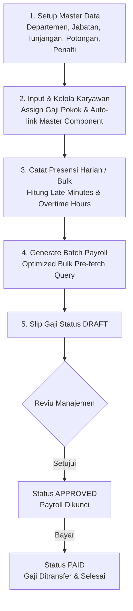

# Panduan Cara Kerja & Arsitektur Sistem Penggajian
## Payroll Management System

Dokumen ini menjelaskan secara rinci alur bisnis, rumus perhitungan matematika, arsitektur teknis, dan cara kerja **Sistem Penggajian** (*Payroll System*).

> Dokumen terkait: [DATABASE_GUIDE.md](DATABASE_GUIDE.md) (struktur tabel & relasi database) dan [STRUCTURE_GUIDE.md](STRUCTURE_GUIDE.md) (peta struktur folder & file kode).

---

## 📌 1. Pendahuluan & Gambaran Umum

Sistem Penggajian ini dirancang untuk mengotomatiskan seluruh alur penggajian bulanan karyawan perusahaan, mulai dari manajemen master data karyawan, alokasi tunjangan & potongan, pencatatan presensi harian (keterlambatan & lembur), hingga pemrosesan komponen *take-home pay* secara massal (*batch generation*).

Sistem dibangun menggunakan stack teknologi modern:
- **Framework**: Next.js 16 (App Router)
- **Database & ORM**: PostgreSQL dengan Prisma ORM
- **Desain UI**: Tailwind CSS & Shadcn UI

---

## 🧮 2. Rumus Perhitungan & Komponen Gaji

Kalkulasi gaji seorang karyawan dihitung berdasarkan periode bulan dan tahun tertentu dengan akumulasi komponen **Pendapatan (*Earnings*)** dan **Potongan (*Deductions*)**.

### A. Komponen Pendapatan (*Earnings*)

1. **Gaji Pokok (`basicSalary`)**
   Nominal gaji dasar bulanan karyawan yang tercatat pada master data `Employee.baseSalary`.

2. **Tunjangan Jabatan (`positionAllowance`)**
   Tunjangan standar yang melekat pada posisi/jabatan karyawan yang tercatat pada `Position.baseAllowance`.

3. **Tunjangan Bulanan (`allowanceTotal`)**
   Tunjangan dihitung **HANYA dari assignment per-karyawan** pada junction table `EmployeeAllowance`, dengan syarat master `Allowance`-nya masih aktif (`isActive`).
   - Karyawan baru otomatis ter-link ke semua master aktif saat dibuat (auto-link); master baru yang aktif otomatis di-backfill ke semua karyawan aktif.
   - Melepas assignment (un-assign) dari seorang karyawan kini benar-benar menghilangkan tunjangan tersebut dari perhitungan gajinya.
   - **Mode `FIXED`**: Nominal tetap dalam Rupiah (contoh: Rp 500.000).
   - **Mode `PERCENTAGE`**: Persentase dari Gaji Pokok ($basicSalary \times \frac{\text{persentase}}{100}$).

4. **Uang Lembur (`overtimePay`)**
   Dihitung otomatis dari akumulasi jam lembur (`Attendance.overtimeHours`) pada bulan tersebut — **hanya dari record berstatus `PRESENT` atau `LATE`** (hari SICK/LEAVE/VACATION/ABSENT tidak menghasilkan lembur).
   Konstanta didefinisikan di `src/lib/constants.ts`:
   - `MONTHLY_WORK_HOURS_DIVISOR = 173` (Kepmenaker No. KEP-102/MEN/VI/2004 Pasal 8)
   - `OVERTIME_MULTIPLIER = 1.5`
   $$\text{Tarif Per Jam} = \frac{\text{basicSalary}}{173}$$
   $$\text{overtimePay} = \text{Math.round}(\text{totalOvertimeHours} \times \text{Tarif Per Jam} \times 1.5)$$
   > **Limitasi yang disengaja:** Kepmenaker 102/2004 sebenarnya mengatur tarif bertingkat (1,5× jam pertama, 2× jam berikutnya, tarif khusus hari libur). Sistem ini memakai pengali flat 1,5× untuk semua jam lembur.

5. **Bonus / Insentif (`bonus`)**
   Bonus tambahan opsional yang dapat diinputkan oleh Admin saat menjalankan proses penggajian.

---

### B. Komponen Potongan (*Deductions*)

1. **Potongan Bulanan (`deductionTotal`)**
   Potongan dihitung **HANYA dari assignment per-karyawan** pada junction table `EmployeeDeduction` dengan master `Deduction` yang masih aktif — pola yang sama dengan tunjangan (auto-link saat create, un-assign berpengaruh).
   - **Mode `FIXED`**: Nominal tetap dalam Rupiah (contoh: Rp 100.000).
   - **Mode `PERCENTAGE`**: Persentase dari Gaji Pokok ($basicSalary \times \frac{\text{persentase}}{100}$).

2. **Denda / Penalti Keterlambatan (`totalLatePenalty`)**
   Dihitung per kejadian terlambat (*per attendance record*, hanya `status = LATE`) dengan mencocokkan `lateMinutes` ke tier `PenaltySetting` (`type = LATE`, aktif).
   - **Mode `FIXED`**: Denda tetap (misal: 11–30 menit = Rp 10.000 per kejadian).
   - **Mode `PERCENTAGE`**: Persentase dari gaji pokok per kejadian.
   - **Label slip** hanya menghitung kejadian/menit yang benar-benar didenda (tier bernilai 0 seperti "Toleransi" tidak menambah hitungan).
   - **Fallback (Default)**: HANYA bila **tidak ada satu pun** aturan LATE di tabel (aktif maupun nonaktif), sistem memakai formula: $\text{Math.round}\left(\text{totalLateMinutes} \times \frac{\text{Tarif Per Jam}}{60}\right)$. Bila aturan ada tetapi semuanya dinonaktifkan, penalti keterlambatan dianggap **dimatikan** (tanpa denda).

3. **Denda / Penalti Ketidakhadiran (`totalAbsentPenalty`)**
   Dihitung per hari alpa/mangkir tanpa keterangan (`status = ABSENT`) mengacu pada `PenaltySetting` (`type = ABSENT`, aktif).
   - **Mode `FIXED`**: Nominal denda per hari alpa.
   - **Mode `PERCENTAGE`**: Persentase dari gaji pokok per hari alpa (contoh: 4.55% ≈ 1/22 gaji pokok per hari).
   - **Fallback (Default)**: HANYA bila tidak ada satu pun aturan ABSENT di tabel: $\text{Math.round}\left(\text{absentDays} \times \frac{\text{basicSalary}}{22}\right)$ (konstanta `DEFAULT_WORKING_DAYS_PER_MONTH = 22`). Semua aturan nonaktif = penalti dimatikan.

---

### C. Gaji Bersih (*Net Salary / Take-Home Pay*)

Gaji bersih akhir yang diterima karyawan dihitung dengan rumus:

$$\text{Net Salary} = \max\Big(0,\; \text{basicSalary} + \text{allowanceTotal} + \text{overtimePay} + \text{bonus} - \text{deductionTotal}\Big)$$

Semua komponen dibulatkan dengan `Math.round`. Bila total potongan melebihi total penerimaan, gaji bersih ditetapkan Rp 0 dan sistem menambahkan baris detail EARNING **"Penyesuaian Gaji Minimum"** sebesar defisit — sehingga penjumlahan rincian slip selalu rekonsiliasi dengan gaji bersih (kelebihan potongan tidak ditagihkan/dibawa ke bulan berikutnya).

---

## 🔄 3. Alur Kerja Pemrosesan Penggajian (*End-to-End Workflow*)

### Penjelasan Tahapan Alur Kerja:

1. **Tahap 1: Setup Master Data & Penalti**
   - Admin mendaftarkan Departemen, Jabatan, Tunjangan (Fixed/Percentage), dan Potongan (Fixed/Percentage).
   - Admin mengonfigurasi aturan penalti Keterlambatan & Ketidakhadiran di halaman Potongan.

2. **Tahap 2: Manajemen Karyawan & Auto-Linking**
   - Saat karyawan baru ditambahkan, sistem secara otomatis menghubungkan karyawan tersebut dengan seluruh Tunjangan Master & Potongan Master yang aktif (`EmployeeAllowance` & `EmployeeDeduction`).

3. **Tahap 3: Pencatatan Presensi & Lembur**
   - Presensi diinput harian atau menggunakan fitur **Bulk Attendance**. Sistem secara otomatis menghitung menit keterlambatan dan jam lembur.

4. **Tahap 4: Pemrosesan Gaji Massal (*Batch Generation*)**
   - Admin memilih bulan & tahun penggajian (serta filter departemen jika diperlukan).
   - Mesin penggajian (`payroll-engine.ts`) mengeksekusi **Bulk Pre-fetch Query** (mengambil seluruh master data dan absensi 1 bulan dalam 1 `Promise.all` paralel) untuk menghindari *N+1 Query Issue*.

5. **Tahap 5: Siklus Slip Gaji (`DRAFT` ➔ `APPROVED` ➔ `PAID`)**
   - Slip gaji yang baru di-generate berstatus **`DRAFT`** (dapat di-generate ulang atau direvisi).
   - Setelah diverifikasi, status diubah menjadi **`APPROVED`** (dikunci, tidak bisa di-generate ulang untuk mencegah perubahan tidak disengaja).
   - Setelah pembayaran berhasil ditransfer, status diubah menjadi **`PAID`**.
   - **Transisi status divalidasi API** dengan state machine: `DRAFT → APPROVED`, `APPROVED → PAID`, `APPROVED → DRAFT` (batalkan persetujuan). `PAID` bersifat final dan tidak dapat diubah lagi (409 bila dilanggar). Timestamp `approvedAt`/`paidAt` dicatat otomatis.
   - **Setujui massal:** tombol "Setujui Semua Draf" (`POST /api/payroll/approve-all`) menyetujui seluruh slip `DRAFT` pada periode terfilter (opsional per departemen) dalam satu aksi; slip `APPROVED`/`PAID` tidak tersentuh.
   - **Kunci kehadiran:** setelah payroll periode karyawan berstatus `APPROVED`/`PAID`, semua penambahan/pengubahan/penghapusan data kehadiran periode tersebut ditolak (409).
   - **Deteksi basi (stale):** detail slip `DRAFT` mengembalikan flag `isStale = true` bila ada data kehadiran periode itu yang berubah setelah slip di-generate — UI menampilkan peringatan "perlu generate ulang". (Best-effort: penghapusan record tidak selalu terdeteksi.)

---

## 🏗️ 4. Struktur Arsitektur Kode Utama

| Berkas / Direktori | Fungsi & Tanggung Jawab |
| :--- | :--- |
| **`src/lib/payroll-engine.ts`** | Core engine perhitungan gaji. Berisi fungsi `calculateSingleEmployeePayroll`, `generateBatchPayroll`, dan `savePayrollRecord`. |
| **`src/app/api/payroll/route.ts`** | Endpoint API daftar slip gaji (GET) beserta filter periode/departemen/status dan ringkasan total. |
| **`src/app/api/payroll/generate/route.ts`** | Endpoint API pemicu *batch generation* (POST) — memanggil `generateBatchPayroll` di engine. |
| **`src/app/api/payroll/approve-all/route.ts`** | Endpoint API setujui massal (POST) — mengubah semua slip `DRAFT` satu periode menjadi `APPROVED`. |
| **`src/app/api/payroll/[id]/route.ts`** | Endpoint API detail slip gaji (GET, termasuk flag `isStale`), pembaruan status (PATCH), dan hapus draft (DELETE). |
| **`src/app/api/penalty-settings/route.ts`** | Endpoint API CRUD untuk aturan penalti terlambat & alpa. |
| **`src/app/(dashboard)/payroll/page.tsx`** | Antarmuka admin: generate batch gaji, daftar slip, ubah status per slip, dan "Setujui Semua Draf". |
| **`src/app/(dashboard)/payroll/[id]/page.tsx`** | Antarmuka detail slip gaji admin + cetak/export PDF. |
| **`src/app/(dashboard)/deductions/page.tsx`** | Antarmuka pengguna untuk mengelola potongan bulanan dan pengaturan penalti presensi. |
| **`src/app/(dashboard)/allowances/page.tsx`** | Antarmuka pengguna untuk mengelola tunjangan bulanan. |
| **`src/app/(dashboard)/reports/page.tsx`** | Antarmuka laporan penggajian & kehadiran per departemen + export CSV. |
| **`docs/DATABASE_GUIDE.md`** | Panduan dokumentasi lengkap mengenai struktur tabel dan ERD database. |
| **`docs/STRUCTURE_GUIDE.md`** | Peta struktur folder & file proyek (app, components, lib, dst.) dalam bahasa sederhana. |

---

## 🛡️ 5. Proteksi Data & Keamanan Transaksi

1. **Prisma Transaction (`prisma.$transaction`)**:
   Penyimpanan header `Payroll` dan baris-baris `PayrollDetail` dibungkus dalam 1 transaksi atomis database. Jika terjadi kegagalan pada salah satu detail, seluruh transaksi otomatis dibatalkan (*rollback*).

2. **Penguncian Gaji Final (`Finalized Lock`)**:
   Slip gaji dengan status `APPROVED` atau `PAID` dilindungi secara ketat. Mesin penggajian akan menolak proses *regenerate* jika slip gaji pada periode tersebut sudah difinalisasi, dan data kehadiran periode tersebut terkunci dari perubahan.

3. **Proteksi Generate Bersamaan**:
   Dua proses generate bersamaan untuk karyawan+periode yang sama ditangkap lewat unique constraint `(employeeId, month, year)` — pihak yang kalah menerima pesan "sedang diproses oleh permintaan lain" alih-alih membuat data ganda.

4. **Autentikasi & Otorisasi**:
   - Token sesi ditandatangani **HMAC-SHA256** dengan `SESSION_SECRET` dari environment (wajib ≥32 karakter di production); verifikasi constant-time.
   - Password karyawan disimpan sebagai **hash bcrypt**; password legacy plaintext otomatis di-upgrade saat login pertama yang berhasil.
   - Kredensial admin (`ADMIN_ID`/`ADMIN_PASSWORD`) wajib dari environment — tidak ada kredensial hardcoded.
   - Setiap handler API admin memanggil `requireAdmin()`; endpoint portal karyawan memverifikasi sesi karyawan. Proxy/middleware hanyalah lapisan pertahanan tambahan.
   - `POST /api/seed` hanya untuk admin dan nonaktif di production kecuali `ALLOW_SEED=true`.

5. **Kontrak Timezone Kehadiran**:
   `checkIn`/`checkOut` disimpan sebagai wall-clock time yang di-anchor ke UTC (`...T08:00:00Z` berarti jam 08:00). Semua klien WAJIB merender dengan getter UTC (`formatTimeUTC`). Data lama yang ditulis sebelum konvensi ini bisa bergeser sampai di-resave atau di-reseed.
