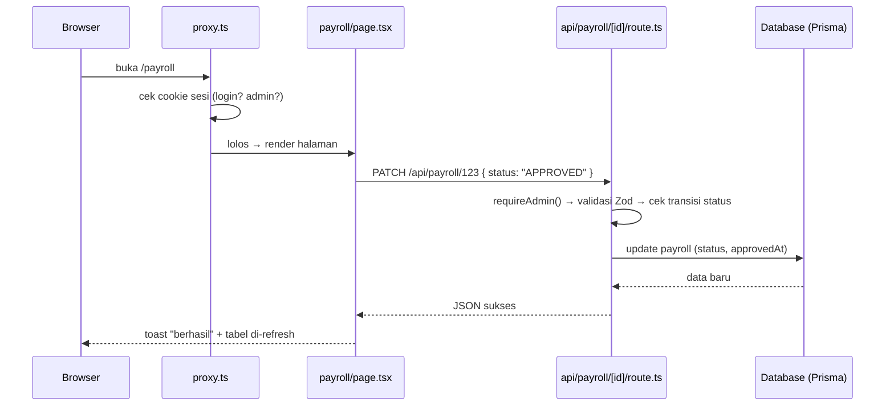

# Panduan Struktur Proyek (Peta Kode)
## Sistem Penggajian (Payroll Management System)

Dokumen ini adalah "peta" untuk memahami isi proyek: folder apa untuk apa, file penting ada di mana, dan kenapa strukturnya dibuat seperti itu. Ditulis dengan bahasa sederhana supaya mudah diikuti, bahkan bila Anda baru mengenal Next.js.

> Dokumen terkait: [PAYROLL_SYSTEM_GUIDE.md](PAYROLL_SYSTEM_GUIDE.md) (alur bisnis & rumus gaji) dan [DATABASE_GUIDE.md](DATABASE_GUIDE.md) (struktur tabel database).

---

## 🗺️ 1. Peta Besar (Folder Root)

```
Payrollsys/
├── prisma/          → definisi database (schema.prisma) + data awal (seed)
├── docs/            → dokumen panduan (file yang sedang Anda baca ada di sini)
├── public/          → file statis (gambar, ikon) yang bisa diakses browser langsung
├── scripts/         → skrip bantu sekali-pakai (mis. tes koneksi database)
├── src/             → SEMUA kode aplikasi ada di sini (dibahas di bawah)
├── .env             → rahasia & konfigurasi lokal (DATABASE_URL, SESSION_SECRET, dll.) — TIDAK ikut ke Git
├── .env.example     → contoh isi .env (aman dibagikan, tanpa nilai rahasia)
├── package.json     → daftar dependency & perintah npm (dev, build, lint)
├── next.config.ts   → konfigurasi Next.js
├── prisma.config.ts → konfigurasi Prisma (lokasi schema & seed)
└── tsconfig.json    → konfigurasi TypeScript (termasuk alias import "@/...")
```

Isi `src/`:

```
src/
├── app/          → halaman web + API (inti aplikasi, aturan folder = URL)
├── components/   → potongan tampilan (UI) yang bisa dipakai ulang
├── hooks/        → logika React yang bisa dipakai ulang (custom hooks)
├── lib/          → "otak" aplikasi: koneksi DB, autentikasi, mesin hitung gaji
├── types/        → definisi tipe data & aturan validasi input (Zod)
├── utils/        → fungsi bantu kecil (format Rupiah, download CSV, dll.)
├── generated/    → hasil generate otomatis Prisma Client — JANGAN diedit manual
└── proxy.ts      → "penjaga pintu" (middleware) yang memeriksa login di setiap request
```

---

## 📁 2. `src/app` — Halaman & API (Aturan: Folder = URL)

Proyek ini memakai **Next.js App Router**. Aturannya sederhana tapi penting:

> **Setiap folder di dalam `src/app` menjadi bagian dari alamat URL.** File bernama khusus di dalamnya yang menentukan apa yang terjadi di alamat itu.

| Nama file | Artinya |
| :--- | :--- |
| `page.tsx` | Halaman web yang dilihat pengguna (ada tampilannya). |
| `route.ts` | Endpoint API (tidak ada tampilan — hanya menerima & membalas data JSON). |
| `layout.tsx` | Bingkai yang membungkus semua halaman di bawah folder itu (mis. sidebar + header). |
| `error.tsx` | Tampilan cadangan bila halaman error/crash. |
| `loading.tsx` | Tampilan sementara saat halaman sedang dimuat. |
| `globals.css` | Gaya CSS global (termasuk aturan cetak/print slip gaji). |

Contoh: folder `src/app/(dashboard)/employees/` berisi `page.tsx` → itulah halaman yang muncul saat membuka `http://localhost:3000/employees`.

### 2.1 Kenapa ada folder bernama `(dashboard)` pakai kurung?

Folder berkurung disebut **route group**. Kurungnya membuat nama folder itu **TIDAK ikut menjadi URL** — jadi `src/app/(dashboard)/payroll/page.tsx` alamatnya tetap `/payroll`, bukan `/dashboard/payroll`.

Lalu untuk apa? **Untuk berbagi satu layout.** File `src/app/(dashboard)/layout.tsx` memasang `AppShell` (sidebar + header). Semua halaman di dalam grup ini otomatis punya sidebar & header, sedangkan halaman `login` sengaja ditaruh **di luar** grup sehingga tampil polos tanpa sidebar.

```
src/app/
├── layout.tsx            → bingkai paling luar (font, tema gelap/terang, toast)
├── login/page.tsx        → halaman login (tanpa sidebar)
└── (dashboard)/          → grup halaman ber-sidebar (nama ini tak muncul di URL)
    ├── layout.tsx        → memasang AppShell (sidebar + header)
    ├── page.tsx          → URL "/"          : Dashboard admin
    ├── employees/        → URL "/employees" : kelola karyawan
    ├── departments/      → URL "/departments"
    ├── positions/        → URL "/positions"
    ├── attendance/       → URL "/attendance" : kehadiran (admin) + dialog absensi massal
    ├── allowances/       → URL "/allowances" : master tunjangan
    ├── deductions/       → URL "/deductions" : master potongan + aturan penalti
    ├── payroll/          → URL "/payroll"   : generate & kelola gaji
    │   └── [id]/         → URL "/payroll/xxx" : detail satu slip gaji (bisa dicetak)
    ├── reports/          → URL "/reports"   : laporan gaji & kehadiran
    └── employee/         → PORTAL KARYAWAN (bukan admin):
        ├── attendance/   → URL "/employee/attendance" : kalender kehadiran saya
        ├── payslips/     → URL "/employee/payslips"   : slip gaji saya
        └── profile/      → URL "/employee/profile"    : profil saya
```

Siapa boleh membuka apa diatur oleh `src/proxy.ts` + pemeriksaan role di tiap API (lihat bagian 2.4).

### 2.2 `src/app/api` — Endpoint API

Semua folder di dalam `src/app/api` berisi `route.ts`, yaitu **API** yang dipanggil halaman lewat `fetch`/`axios`. Satu file `route.ts` bisa mengekspor beberapa fungsi sesuai metode HTTP:

```ts
export async function GET(request)  { ... }  // membaca data
export async function POST(request) { ... }  // membuat data baru
```

Daftar API dikelompokkan per "benda" (resource):

```
src/app/api/
├── auth/        → login, logout, me (cek siapa yang sedang login)
├── employees/   → data karyawan          ─┐
├── departments/ → data departemen         │ pola sama:
├── positions/   → data jabatan            │ route.ts       = daftar + tambah
├── allowances/  → master tunjangan        │ [id]/route.ts  = detail + ubah + hapus
├── deductions/  → master potongan        ─┘
├── penalty-settings/ → aturan denda telat/alpa
├── attendance/  → kehadiran (+ bulk/ untuk absensi massal)
├── payroll/     → gaji (+ generate/ dan approve-all/)
├── reports/     → laporan gaji & kehadiran (hanya baca)
├── dashboard/   → angka ringkasan untuk halaman Dashboard
├── employee/    → API khusus portal karyawan (data miliknya sendiri)
└── seed/        → isi database dengan data contoh (khusus admin, non-production)
```

### 2.3 Kenapa ada `route.ts` di dalam folder `[id]`?

Folder berkurung siku seperti `[id]` disebut **dynamic segment** — artinya bagian URL itu adalah **nilai yang berubah-ubah** (placeholder), bukan nama tetap.

Bayangkan dua kebutuhan yang berbeda:

| URL | Melayani apa | File yang menangani |
| :--- | :--- | :--- |
| `/api/employees` | SEMUA karyawan (daftar) & tambah baru | `api/employees/route.ts` → `GET` (list), `POST` (create) |
| `/api/employees/b41f-...` | SATU karyawan tertentu (id `b41f-...`) | `api/employees/[id]/route.ts` → `GET` (detail), `PUT` (ubah), `DELETE` (hapus) |

Jadi `[id]` diperlukan karena **operasi terhadap satu data** (lihat detail, ubah, hapus) butuh tahu *data yang mana* — dan "yang mana" itu dibawa lewat URL. Apa pun yang diketik di posisi itu (`/api/employees/APAPUN`) akan masuk ke `route.ts` di dalam `[id]`, dan nilainya bisa dibaca di kode:

```ts
export async function GET(
  req: NextRequest,
  { params }: { params: Promise<{ id: string }> }
) {
  const { id } = await params; // "APAPUN" tadi masuk ke sini
  const employee = await prisma.employee.findUnique({ where: { id } });
}
```

> Catatan Next.js 16: `params` berbentuk `Promise`, jadi wajib di-`await` dulu.

Pola yang sama berlaku untuk halaman: `src/app/(dashboard)/payroll/[id]/page.tsx` menangani `/payroll/<id-slip-apapun>` — satu file untuk ribuan kemungkinan slip.

**Lalu kenapa ada folder `generate/`, `approve-all/`, `bulk/`?** Itu untuk **aksi khusus** yang bukan CRUD biasa. "Generate gaji satu bulan" bukan "menambah satu payroll", melainkan sebuah proses — jadi dibuat alamat sendiri: `POST /api/payroll/generate`. Sama halnya `POST /api/payroll/approve-all` (setujui semua draf) dan `POST /api/attendance/bulk` (absensi massal).

### 2.4 `src/proxy.ts` — Penjaga Pintu (Middleware)

File ini berjalan **sebelum** halaman/API mana pun dieksekusi, pada **setiap request**. Tugasnya:

1. Membaca cookie sesi dan memverifikasi tanda tangannya (HMAC).
2. Belum login tapi membuka halaman dashboard? → dilempar ke `/login`.
3. Role `EMPLOYEE` mencoba membuka halaman admin? → dilempar ke portal karyawan.

Penting dipahami: proxy hanyalah **lapisan pertama**. Setiap handler API tetap memeriksa ulang haknya sendiri dengan `requireAdmin()` / `requireAuth()` dari `src/lib/authz.ts` — sehingga API tetap aman meskipun ada cara melewati proxy.

---

## 🧩 3. `src/components` — Potongan Tampilan (UI)

Dibagi 4 subfolder sesuai "kasta"-nya:

| Folder | Isi | Aturan main |
| :--- | :--- | :--- |
| `ui/` | Komponen dasar dari shadcn/base-ui: `button`, `input`, `dialog`, `select`, `table`, `card`, `badge`, `sheet`, `sonner` (toast), dll. | Generik & bebas logika bisnis. Jarang perlu diedit — kecuali mengubah gaya dasar seluruh aplikasi (mis. ukuran tombol di mobile). |
| `layout/` | Kerangka halaman: `app-shell` (susunan sidebar+header+konten), `header`, `sidebar`, `data-table` (tabel siap pakai: cari, urut, halaman), `confirm-dialog` (dialog "Yakin hapus?"). | Dipakai oleh banyak halaman sekaligus — hati-hati mengubahnya. |
| `shared/` | Komponen kecil lintas halaman: `stat-card` (kartu angka statistik), `money-input` (input Rupiah). | Tambahkan di sini bila sebuah komponen mulai dipakai ≥2 halaman. |
| `providers/` | Pembungkus data global: `session-provider` (info siapa yang login, dipakai lewat `useSession()`), `theme-provider` (mode gelap/terang). | Dipasang sekali di layout, diakses dari mana saja. |

---

## 🪝 4. `src/hooks` — Logika React Siap Pakai

Berisi *custom hooks* (fungsi berawalan `use...`) yang membungkus logika berulang:

- **`use-delete-confirm.ts`** — mengelola alur "klik hapus → muncul dialog konfirmasi → jalankan hapus → dialog tertutup bila sukses / tetap terbuka bila gagal". Dipakai hampir semua halaman yang punya tombol hapus, supaya perilakunya seragam.

---

## 🧠 5. `src/lib` — Otak Aplikasi

Folder terpenting untuk logika. Isinya:

| File | Tugas |
| :--- | :--- |
| `prisma.ts` | Membuat koneksi database (Prisma Client) — satu untuk seluruh aplikasi. Juga mengatur agar kolom `password` **tidak pernah** ikut terkirim ke browser. |
| `payroll-engine.ts` | **Mesin hitung gaji.** Membaca kehadiran + tunjangan/potongan per-karyawan + aturan penalti, lalu menghasilkan slip beserta rinciannya. Rumusnya dijelaskan di [PAYROLL_SYSTEM_GUIDE.md](PAYROLL_SYSTEM_GUIDE.md). |
| `session.ts` | Membuat & memverifikasi token sesi (HMAC-SHA256). Sengaja TIDAK meng-import prisma agar aman dipakai `proxy.ts`. |
| `auth.ts` | Memverifikasi kredensial login: admin (dari env) dan karyawan (bcrypt; password lama otomatis di-upgrade ke hash saat login). |
| `authz.ts` | `requireAdmin()` / `requireAuth()` — dipanggil di awal SETIAP handler API untuk memastikan yang memanggil berhak. |
| `attendance.ts` | Hitung otomatis menit terlambat & jam lembur dari jam masuk/keluar; konversi jam ke format simpan UTC. |
| `payroll-guard.ts` | Pengecekan "apakah periode ini sudah digaji final (APPROVED/PAID)?" — dipakai untuk mengunci data kehadiran. |
| `constants.ts` | Angka & label tetap: pembagi 173 jam (aturan lembur), 22 hari kerja, pengali lembur 1,5×, nama bulan, label status. |
| `navigation.ts` | SATU sumber daftar menu sidebar untuk role ADMIN dan EMPLOYEE (dipakai sidebar desktop, drawer mobile, dan judul header). |
| `api-client.ts` | Fungsi bantu memanggil API dari halaman (ambil pesan error yang rapi, ambil semua halaman data, dll.). |
| `utils.ts` | `cn()` — penggabung class Tailwind. |

---

## 📐 6. `src/types` & 🔧 7. `src/utils`

**`src/types/index.ts`** — dua peran dalam satu file:
1. **Tipe TypeScript** bersama (bentuk data `PayrollItem`, `Employee`, dsb.) supaya halaman dan API "berbicara" dengan bentuk data yang sama.
2. **Skema validasi Zod** (`employeeSchema`, `attendanceSchema`, `periodSchema`, ...) — setiap input yang masuk ke API dicek dulu di sini; input tak valid ditolak dengan pesan error per-kolom.

**`src/utils/`** — fungsi bantu kecil murni:

| File | Isi |
| :--- | :--- |
| `format.ts` | Format Rupiah (`formatCurrency`), tanggal, dan **`formatTimeUTC`** (wajib untuk menampilkan jam kehadiran — lihat kontrak timezone di [DATABASE_GUIDE.md](DATABASE_GUIDE.md)). |
| `api-response.ts` | Bentuk balasan API yang seragam (`successResponse`/`errorResponse`) + pembaca parameter list (page, search, sort) yang aman. |
| `csv.ts` | `downloadCSV` — export tabel ke file CSV. |
| `status.ts` | Pemetaan status → warna badge, agar konsisten di semua halaman. |

---

## ⚙️ 8. `prisma/` dan `src/generated/`

- **`prisma/schema.prisma`** — definisi seluruh tabel database (satu-satunya sumber kebenaran skema). Setelah mengubahnya, jalankan `npx prisma db push` (sinkron ke database) — Prisma Client akan ter-generate ulang ke `src/generated/prisma/`.
- **`prisma/seed.ts`** — data awal minimal (departemen, jabatan, master tunjangan/potongan, aturan penalti, 3 karyawan contoh). Jalankan dengan `npx prisma db seed`.
- **`src/generated/prisma/`** — kode Prisma Client hasil generate. **Jangan pernah mengedit isinya** — perubahan apa pun akan hilang saat generate berikutnya.

---

## 🔄 9. Alur Satu Permintaan (Contoh Nyata)

Supaya semua bagian di atas "terhubung", ini yang terjadi saat **admin membuka halaman Penggajian** lalu menekan **Setujui** pada satu slip:



Urutan pemeriksaan di setiap API selalu sama: **(1)** `requireAdmin`/`requireAuth` → **(2)** validasi input dengan Zod → **(3)** aturan bisnis (mis. transisi status yang sah) → **(4)** baru menyentuh database.

---

## 🧭 10. Mau Mengubah Sesuatu? Mulai dari Sini

| Ingin mengubah... | Buka file... |
| :--- | :--- |
| Rumus perhitungan gaji/lembur/denda | `src/lib/payroll-engine.ts` (+ konstanta di `src/lib/constants.ts`) |
| Tampilan halaman tertentu | `src/app/(dashboard)/<nama-halaman>/page.tsx` |
| Perilaku API tertentu | `src/app/api/<resource>/route.ts` atau `.../[id]/route.ts` |
| Kolom/tabel database | `prisma/schema.prisma` → lalu `npx prisma db push` |
| Aturan validasi input form/API | `src/types/index.ts` |
| Menu sidebar / hak akses halaman | `src/lib/navigation.ts` dan `src/proxy.ts` |
| Tampilan dasar tombol/dialog/tabel di semua halaman | `src/components/ui/` |
| Format Rupiah/tanggal/jam | `src/utils/format.ts` |
| Tampilan cetak slip gaji | blok `@media print` di `src/app/globals.css` |
